# Auto YouthStudy-Tianjin

天津市青年大学习 刷学习次数/刷人数(完成率) 工具

**<u>本工具仅供交流学习使用,请勿用于非法用途</u>**

## 使用方法

1. 刷次数

  ```shell
  python main.py num
  ```

  ```shell
  python num.py --cookie[ --epochs][ --tasks][ --requests][ --wait][ --waite][ --out][ --proxy]
  ```

2. 实时学习次数显示

  ```shell
  python main.py rank
  ```

  ```shell
  python rank.py --cookie[ --once][ --interval]
  ```

3. 刷人数

  ```shell
  python main.py person
  ```

  ```shell
  python person.py --cookie --deptId --file[ --title][ --proxy]
  ```

4. 爬取团支部id

  ```shell
  python deptId.py[ --proxy]
  ```

**更新: 所有参数可在配置文件中修改, 使用main文件使用配置文件并选择模式**

## 推荐

1. 刷次数

	运行一次理论次数200,000次,理论时间490s

	```shell
	python num.py -c xxxxxxxxx -e 4 -t 50 -r 1000 --wait 0.1 -waite 30
	```

2. 刷人数

	```shell
	python person.py -c xxxxxxxxx -d 100xxxxxxxxxxxxx -f ./xxx.csv
	```

	xxx.csv:

	| name     | tel   | type | sex |
	|----------|-------|------|-----|
	| falling1 | xxxx1 | 2    | 1   |
	| falling2 | xxxx2 | 2    | 1   |
	| falling3 | xxxx3 | 2    | 1   |
	| falling4 | xxxx4 | 2    | 1   |

## 参数

#### main

- `-m` `--mode` 模式(num/person/rank)
- `-c` `--config-file` 配置文件路径(默认为.\config.json, urf-8)

#### num

* `-c` `--cookie` cookie
* `-e` `--epochs` 运行次数
* `-t` `--tasks` task数量
* `-r` `--requests` 单个task循环请求次数,最好不要超过1000
*  `--wait` 单个task中每次请求后等待时间(s)
*  `--waite` 每次循环后等待时间(s)
* `-o` `--out` 是否打印报文(y/n)
* `-p` `--proxy` 设置代理,格式为"ip:port"

#### rank

- `-c` `--cookie` cookie,同num.py
- `-o` `--once` 只获取一次排名(y/n)
- `-i` `--interval` 连续获取排名的间隔时间(s)
- `-p` `--proxy` 设置代理,同num.py

#### person

- `-c` `--cookie` cookie,同num.py
- `-d` `--deptId` 所在团支部的id,可通过浏览器f12查看或通过deptId.py爬取查找
- `-f` `--file` 读取信息的csv文件,格式为4列,分别对应:名字,电话(这个字段不能设置相同的值),团员青年/普通青年(1/2),性别:男/女(1/2)
- `-t` `--title` 读取文件是否加载第一行(默认为否,若csv文件没有表头可设置为"y")
- `-p` `--proxy` 设置代理,同num.py

#### deptId

- `-p` `--proxy` 设置代理,同num.py

## 如何获取cookie

可以通过Fiddle(电脑)或HttpCanary(手机)抓取访问青年大学习时的cookie, 然后将"JSESSIONID="后边的部分截取下来作为参数传入`--cookie`

## 刷次数高并发的次数与间隔

1. tasks 协程task数目
2. requests 每个task中发送请求的次数
3. wait 第2条中每次发送请求后的等待间隔
4. epochs 程序重复次数
5. waite 每次epoch后等待的时间
6. print 是否打印出返回的报文, 例如 "HTTP/1.1 302 \r\nServer: CloudWAF\r\nDate: ..."

理论次数 = t * r * epochs

理论耗时 = (r * wait * n + waite) * epochs - waite

*n为正整数,一般为1,除非执行tn次发送报文的时间大于wait时间,n为发送tn次报文所需时间除以wait时间向上取整*

如图

```mermaid
        gantt
        dateFormat SSS
        axisFormat %L
        title http报文发送流程图
        start : milestone, start, after 000, 0ms
        epoch1-start : milestone, e1start, after start, 0ms
        section task1
        1-send1                      			:done, 1-1send1, after e1start, 1ms
        1-wait1									:done, 1-1wait1, after 1-1send1, 10ms
        1-recv1                      			:done, 1-1recv1, after 1-1wait1, 1ms
        1-send2                      			:done, 1-1send2, after 1-1recv1, 1ms
        1-wait2									:done, 1-1wait2, after 1-1send2, 10ms
        1-recv2                      			:done, 1-1recv2, after 1-1wait2, 1ms
        section task2                                                
      	2-send1                      			:done, 1-2send1, after 1-1send1, 1ms
      	2-wait1									:done, 1-2wait1, after 1-2send1, 10ms
      	2-recv1                      			:done, 1-2recv1, after 1-2wait1, 1ms
      	2-send2                      			:done, 1-2send2, after 1-2recv1, 1ms
      	2-wait2									:done, 1-2wait2, after 1-2send2, 10ms
      	2-recv2                      			:done, 1-2recv2, after 1-2wait2, 1ms
        section task3                                                
        3-send1                             	:done, 1-3send1, after 1-2send1, 1ms
        3-wait1									:done, 1-3wait1, after 1-3send1, 10ms
        3-recv1                      			:done, 1-3recv1, after 1-3wait1, 1ms
        3-send2                      			:done, 1-3send2, after 1-3recv1, 1ms
        3-wait2									:done, 1-3wait2, after 1-3send2, 10ms
        3-recv2                      			:done, 1-3recv2, after 1-3wait2, 1ms
        epoch1-end : milestone, e1end, after 1-3recv2, 0ms
        wait-epoch : done, we1, after 1-3recv2, 10ms
        epoch2-start : milestone, e2start, after we1, 0ms
        section task1                                                                   
        1-send1                      			:done, 2-1send1, after e2start, 1ms               
        1-wait1									:done, 2-1wait1, after 2-1send1, 10ms   
        1-recv1                      			:done, 2-1recv1, after 2-1wait1, 1ms    
        1-send2                      			:done, 2-1send2, after 2-1recv1, 1ms    
        1-wait2									:done, 2-1wait2, after 2-1send2, 10ms   
        1-recv2                      			:done, 2-1recv2, after 2-1wait2, 1ms    
        section task2                                                                   
      	2-send1                      			:done, 2-2send1, after 2-1send1, 1ms    
      	2-wait1									:done, 2-2wait1, after 2-2send1, 10ms   
      	2-recv1                      			:done, 2-2recv1, after 2-2wait1, 1ms    
      	2-send2                      			:done, 2-2send2, after 2-2recv1, 1ms    
      	2-wait2									:done, 2-2wait2, after 2-2send2, 10ms   
      	2-recv2                      			:done, 2-2recv2, after 2-2wait2, 1ms    
        section task3                                                                   
        3-send1                             	:done, 2-3send1, after 2-2send1, 1ms    
        3-wait1									:done, 2-3wait1, after 2-3send1, 10ms   
        3-recv1                      			:done, 2-3recv1, after 2-3wait1, 1ms    
        3-send2                      			:done, 2-3send2, after 2-3recv1, 1ms    
        3-wait2									:done, 2-3wait2, after 2-3send2, 10ms   
        3-recv2                      			:done, 2-3recv2, after 2-3wait2, 1ms   
        epoch2-end : milestone, e2end, after 2-3recv2, 0ms  
        end : milestone, e2end, after e2end, 0ms
```



## 其他

至于为什么一开始就是v5.x.x开头,咳咳之前有过4版我自己用的,现在整合了一下就v5了hhh

网站很容易很容易很容易很容易×n寄,不要滥用啊喂

网站寄的情况一般有3种

1. 可以访问,但是次数不增加
2. 主页面可以访问,学习排行502/504(这种情况点击学习排行很可能导致情况3,我也不知道为啥)
3. 主页面504

**添加了代理模式**

如需进行高并发请使用代理保证安全(我劝你善良

注意点网站坏了就别玩了

**添加了刷人数**

就是说这网站的逻辑我真蚌埠住,懒得写了反正就很逆天

悠着点用要是人家长脑子了改了就用不了了

**刷人数里面电话那个字段大概率有sql漏洞,请不要进行任何sql注入的尝试**
