# Auto_YouthStudy_Tianjin

天津市青年大学习刷学习次数工具

**<u>本工具仅供交流学习使用,请勿用于非法用途</u>**

## 使用方法

```shell
python main.py --cookie[ --epochs[ --tasks-num[ --requests-num[ --wait[ --wait-epoch[ --out[ --proxy]]]]]]]
```

```shell
python rank.py --cookie[ --once[ --interval]]
```

## 参数

main.py

* `-c` `--cookie` cookie
* `-e` `--epochs` 重复次数
* `-tn` `--tasks-num` task数量
* `-rn` `--requests-num` 单个task循环请求次数,最好不要超过1000
* `-w` `--wait` 单个task中每次请求后等待时间(s)
* `-we` `--wait-epoch` 每次循环后等待时间(s)
* `-o` `--out` 是否打印报文(y/n)
* `-p` `--proxy` 设置代理,格式为"ip:port"

rank.py

- `-c` `--cookie` cookie,同main.py
- `-o` `--once` 只获取一次排名(y/n)
- `-i` `--interval` 连续获取排名的间隔时间(s)


## 如何获取cookie

可以通过Fiddle(电脑)或HttpCanary(手机)抓取访问青年大学习时的cookie, 然后将"JSESSIONID="后边的部分截取下来作为参数传入`--cookie`

## 次数与间隔

1. tasks-num 协程task数目
2. requests-num 每个task中发送请求的次数
3. wait 第2条中每次发送请求后的等待间隔
4. epoch 程序重复次数
5. wait-epoch 每次epoch后等待的时间
6. print 是否打印出返回的报文, 例如 "HTTP/1.1 302 \r\nServer: CloudWAF\r\nDate: ..."

理论次数 = tn * rn * epochs

理论耗时 = (rm * w * n + we) * epochs - we

*n为正整数,一般为1,除非执行tn次发送报文的时间大于wait时间,n为发送tn次报文所需时间除以wait时间向上取整*

如图

```mermaid
        gantt
        dateFormat SSS
        axisFormat %L
        title http报文发送流程图
        start : milestone, start, after 000, 0ms
        epoch1-start : milestone, e1start, after start, 0ms
        section task1
        1-send1                      			:done, 1-1send1, after e1start, 1ms
        1-wait1									:done, 1-1wait1, after 1-1send1, 10ms
        1-recv1                      			:done, 1-1recv1, after 1-1wait1, 1ms
        1-send2                      			:done, 1-1send2, after 1-1recv1, 1ms
        1-wait2									:done, 1-1wait2, after 1-1send2, 10ms
        1-recv2                      			:done, 1-1recv2, after 1-1wait2, 1ms
        section task2                                                
      	2-send1                      			:done, 1-2send1, after 1-1send1, 1ms
      	2-wait1									:done, 1-2wait1, after 1-2send1, 10ms
      	2-recv1                      			:done, 1-2recv1, after 1-2wait1, 1ms
      	2-send2                      			:done, 1-2send2, after 1-2recv1, 1ms
      	2-wait2									:done, 1-2wait2, after 1-2send2, 10ms
      	2-recv2                      			:done, 1-2recv2, after 1-2wait2, 1ms
        section task3                                                
        3-send1                             	:done, 1-3send1, after 1-2send1, 1ms
        3-wait1									:done, 1-3wait1, after 1-3send1, 10ms
        3-recv1                      			:done, 1-3recv1, after 1-3wait1, 1ms
        3-send2                      			:done, 1-3send2, after 1-3recv1, 1ms
        3-wait2									:done, 1-3wait2, after 1-3send2, 10ms
        3-recv2                      			:done, 1-3recv2, after 1-3wait2, 1ms
        epoch1-end : milestone, e1end, after 1-3recv2, 0ms
        wait-epoch : done, we1, after 1-3recv2, 10ms
        epoch2-start : milestone, e2start, after we1, 0ms
        section task1                                                                   
        1-send1                      			:done, 2-1send1, after e2start, 1ms               
        1-wait1									:done, 2-1wait1, after 2-1send1, 10ms   
        1-recv1                      			:done, 2-1recv1, after 2-1wait1, 1ms    
        1-send2                      			:done, 2-1send2, after 2-1recv1, 1ms    
        1-wait2									:done, 2-1wait2, after 2-1send2, 10ms   
        1-recv2                      			:done, 2-1recv2, after 2-1wait2, 1ms    
        section task2                                                                   
      	2-send1                      			:done, 2-2send1, after 2-1send1, 1ms    
      	2-wait1									:done, 2-2wait1, after 2-2send1, 10ms   
      	2-recv1                      			:done, 2-2recv1, after 2-2wait1, 1ms    
      	2-send2                      			:done, 2-2send2, after 2-2recv1, 1ms    
      	2-wait2									:done, 2-2wait2, after 2-2send2, 10ms   
      	2-recv2                      			:done, 2-2recv2, after 2-2wait2, 1ms    
        section task3                                                                   
        3-send1                             	:done, 2-3send1, after 2-2send1, 1ms    
        3-wait1									:done, 2-3wait1, after 2-3send1, 10ms   
        3-recv1                      			:done, 2-3recv1, after 2-3wait1, 1ms    
        3-send2                      			:done, 2-3send2, after 2-3recv1, 1ms    
        3-wait2									:done, 2-3wait2, after 2-3send2, 10ms   
        3-recv2                      			:done, 2-3recv2, after 2-3wait2, 1ms   
        epoch2-end : milestone, e2end, after 2-3recv2, 0ms  
        end : milestone, e2end, after e2end, 0ms
```



## 推荐参数

运行一次理论次数200,000次,理论时间490s

```shell
python main.py -c xxxxxxxxx -e 4 -tn 50 -rn 1000 -w 0.1 -we 30
```

## 其他

至于为什么一开始就是v5.x.x开头,咳咳之前有过4版我自己用的,现在整合了一下就v5了hhh

网站很容易很容易很容易很容易×n寄,不要滥用啊喂

网站寄的情况一般有3种

1. 可以访问,但是次数不增加
2. 主页面可以访问,学习排行502/504(这种情况点击学习排行很可能导致情况3,我也不知道为啥)
3. 主页面504

出现这种情况就别刷了,等网站好了再说,如果你会的话可以整个代理(整完发个pr我懒得弄了),安全为重QaQ

现已加了代理模式,如需进行高并发请使用代理
